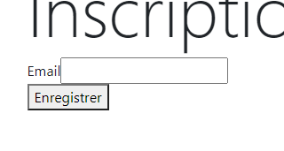
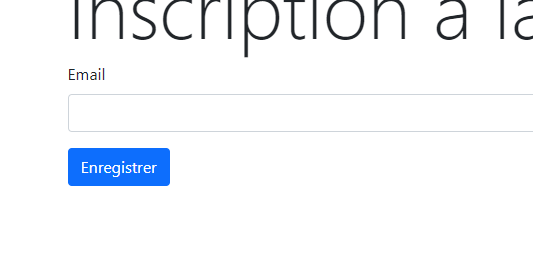

# B2 - Symfony

## Composer

### Dépendances

Composer est un gestionnaire de dépendances nous permettant de déclarer les packages externes à notre application, que l'on souhaite utiliser.

On peut utiliser Composer pour créer notre application Symfony, par exemple.

On peut également utiliser Composer pour importer une dépendance isolée (un composant Symfony seul par exemple).

### Autoloading

Composer peut également nous permettre de gérer la manière dont on va charger les classes de notre application.

Par exemple, si on souhaite utiliser [`PSR-4`](https://www.php-fig.org/psr/psr-4/), on peut lui indiquer.

> composer.json

On vient fixer ici le fait que le namespace "App" correspond au dossier "src/" de notre application.

Ainsi, il agira comme un espace de nom "racine" et suivra l'arborescence de notre application.

```json
{
  "autoload": {
    "psr-4": {
      "App\\": "src/"
    }
  }
}
```

### Versioning

On trouvera une stratégie de versioning [`semver`](https://devhints.io/semver) pour les packages en PHP.

Le versioning `semver` est divisé en 3 parties. De gauche à droite :

- Version majeure (_Cette version introduit des changements significatifs par rapport à la version précédente, certaines fonctionnalités qui précédaient sont supprimées par exemple_)
- Version mineure (_On peut introduire de nouvelles choses dans une version mineure par exemple, en s'assurant que tout ce qui existe déjà continue de fonctionner_)
- Version de patch (_Correctifs de bugs et sécurité_)

Les packages Composer se trouvent pour leur grande majorité sur [packagist.org](https://packagist.org/).

## Symfony

Comme indiqué sur [la page d'accueil](https://symfony.com/), Symfony est avant tout **un ensemble de composants PHP réutilisables**.

Le framework Symfony en lui-même vient rassembler plusieurs dizaines de ces composants, dans une structure (arborescence) précise. On construit ensuite notre application dans cette structure.

### Versions

Symfony adopte également le système de versioning `semver`, et présente une nouvelle version majeure tous les 2 ans.

Pendant ces 2 années, on aura 5 versions mineures : de 0 à 4.

La version mineure n°4 sera donc la dernière sous-version d'une version majeure (3.4, 4.4, etc...), et elle sortira en même temps que la version majeure suivante.

Ainsi, les versions 3.4, 4.4, etc...sont appelées des versions **LTS** ou Long-Term Support : un support sur la correction de bug et de failles de sécurité est assuré sur ces versions pendant 3 ans pour les corrections de bugs et 4 ans pour les failles de sécurité.

### Installation en version 5.4 LTS

Pour installer un projet Symfony avec la version 5.4, donc la LTS, on va utiliser le [binaire de Symfony](https://symfony.com/download) (ou Symfony CLI) :

```bash
symfony new my_project_directory --version=5.4 --webapp
```

> Note : on peut créer 2 types d'application Symfony : des applications destinées à la création de microservices, API, ou applications console par exemple, et des applications web complètes, incluant un moteur de template (Twig). Dans ce cas, on ajoute l'option `--webapp` à l'instruction de ligne de commande permettant de créer l'application. La base d'installation reste la même (package Composer `symfony/skeleton`)

A l'exécution de cette commande, on verra défiler les différents composants issus de packagist.org, qui sont intégrés automatiquement par le framework dans nos dépendances.

### Environnements

Dans une application Symfony, l'environnement par défaut dans lequel nous allons travailler est `dev`, par défaut.

L'environnement se présentera sous forme d'une variable d'environnement `APP_ENV`.

Il y a 3 environnements prévus par Symfony par défaut : `dev`, pour la phase de développement, `test` pour les tests unitaires, fonctionnels, etc... et `prod` pour le déploiement en production, qui nous permet d'optimiser la configuration de l'application pour qu'elle soit plus rapide.

### Arborescence

#### `/assets`

Ce dossier contient des fichiers Javascript qui composeront la partie front-end, donc l'interface, si nous utilisons l'outil **Webpack Encore** fourni par Symfony.

Webpack Encore permet de développer des interfaces modulaires avec Javascript et le **bundler** [Webpack](https://v4.webpack.js.org/).

#### `/bin`

Ce dossier contient 1 fichier qui va être très important : `console`. La console Symfony (**différente de l'outil Symfony CLI**) nous fournira des commandes utilitaires permettant de générer des fichiers au sein de notre arborescence, accélérant le développement de notre application, mais aussi garantissant une meilleure constance dans le style du code : la génération via des templates s'effectue toujours de la même façon, nous aurons uniquement à ajouter le code propre à notre application.

#### `/config`

Ce dossier, comme son nom le laisse facilement deviner, contient les fichiers de configuration des différents packages utilisés dans l'application.

Les fichiers de configuration utilisent le format [`yaml`](https://fr.wikipedia.org/wiki/YAML), basé sur l'indentation des différentes sections.

Se trouvent également 2 fichiers `bundles.php`, regroupant les composants applicatifs que l'on souhaite activer dans notre application, selon l'environnement, et `preload.php` pour le preloading introduit par PHP 7.4 pour le pré-chargement de scripts.

#### `/migrations`

Les migrations contiendront des classes PHP décrivant les changements de structure de notre base de données, quand nous travaillerons avec une BDD.

#### `/public`

Ce dossier contient uniquement un fichier `index.php`, qui va être le point d'entrée de notre application.

#### `/src`

Dans ce dossier, on retrouvera les classes de notre application.

On va avoir par exemple le dossier `Controllers` dans lequel se trouveront toutes les classes de contrôleurs permettant de gérer la navigation et le routage dans notre application.

Les entités (donc le modèle) se trouveront elles dans le dossier `Entity`.

Les repositories, dans le dossier `Repository`, seront notre couche de services, permettant de requêter nos modèles.

Nous n'aurons pas à toucher le fichier `Kernel.php`, c'est le noyau de Symfony.

#### `/templates`

Ce dossier contiendra tous nos templates, écrits avec `Twig`, un moteur de template que nous verrons plus tard.

#### `/translations`

Ce dossier contiendra des fichiers de traduction, si nous voulons travailler sur une application présentant des libellés multilingues, ou encore chaînes localisées.

#### `/var`

Ce dossier est destiné à recevoir des données de caches et de logs, il n'est pas intégré au gestionnaire de versions si on en utilise un.

On trouvera par exemple les fichiers issus de la compilation du conteneur applicatif, dans le dossier `cache`.

#### `/vendor`

Le dossier `/vendor` est géré par Composer, pour y inscrire la méthode d'autoloading ainsi que les sources des dépendances utilisées dans l'application.

On remarquera qu'il n'est pas versionné.

En effet, ce dossier est **entièrement** géré par Composer. Ainsi, lorsqu'on va clôner ou forker un dépôt de sources, on pourra utiliser la commande `composer install` pour le générer. Il contient souvent des milliers de fichiers issus des dépendances de notre application, il est donc inutile de commit et push tous ces fichiers sur un dépôt distant.

#### `.env`

Ce fichier contient les variables d'environnement de l'application.

Il contient en premier lieu la définition de l'environnement (`APP_ENV`).

Nous verrons plus tard l'utilité de définir plusieurs fichiers contenant des variables d'environnement et les stratégies de versioning associées.

#### `.gitignore`

Tous les fichiers à ne pas intégrer au gestionnaire de versions.

#### `composer.json`

Le fichier Composer principal, qui contient toutes nos dépendances, et la méthode d'autoloading, entre autres.

On trouvera, entre autres, les dépendances de notre application dans 2 catégories : `require` et `require-dev`.

`require` regroupe les dépendances utilisées tout le temps.

Dans `require-dev`, on placera ce qu'on va appeler **des dépendances de développement**. Cela va concerner essentiellement les tests unitaires, ou utilitaires que l'on peut mettre en oeuvre lors de la phase de développement d'une application.

> En production par exemple, on ne voudra pas des dépendances de développement. On pourra ainsi demander à Composer de ne pas les intégrer au projet : `composer install --no-dev`

#### `composer.lock`

Ce fichier est celui consulté par Composer lorsque vous effectuez un `composer install`, pour installer toutes les dépendances préalablement définies.

On peut le voir comme l'équivalent du `package-lock.json` avec npm, qui permet de regrouper les versions installées.

Ainsi, n'importe qui de nouveau sur le projet peut faire un `composer install` après avoir clôné ou forké le projet : il aura exactement les mêmes versions que nous.

#### `docker-compose.override.yml & docker-compose.yml`

Ces 2 fichiers décrivent le ou les services à instancier pour l'outil de conteneurisation [**Docker**](https://www.docker.com/), et plus précisément l'utilitaire `docker-compose`.

#### `package.json`

Tout comme `composer.json`, qui regroupe les dépendances Composer utilisées pour le back-end de notre application, ce fichier regroupe les dépendances à intégrer pour **npm** (Node Package Manager).

Vous retrouverez notamment la dépendance `@symfony/webpack-encore`, qui, comme cité plus haut, permet de développer des interfaces modulaires gérées ensuite par l'outil Webpack.

#### `symfony.lock`

Ce fichier sert à un outil intégré avec la version 4 de Symfony : Symfony Flex.

Symfony Flex est un outil construit au-dessus de Composer. Il permet, dans un projet Symfony, en plus d'installer une dépendance, d'exécuter des **recettes**, comme des scripts de pré-configuration d'un package.

Vu que nous nous situons dans un framework, il adopte une certaine structure (dossier `config` pour la configuration, autoloading `PSR-4` avec `App` comme espace de nom racine, etc...).

Lorsqu'on installe une dépendance avec la commande `composer require`, Flex peut alors entrer en jeu en créant automatiquement un fichier de configuration à l'endroit adéquat, ou bien un template de classe PHP dans `src`, etc...**il va nous aider à l'intégration d'un package au sein d'une application Symfony**.

Ce fichier garde, en plus de la version du package, la version de la recette exécutée.

#### `webpack.config.js`

Le fichier de configuration du workflow de Webpack, et plus précisément ici de Webpack Encore.

Ce fichier décrit les différentes actions à effectuer pour bundler le front-end de notre application. ON y trouvera par exemple des méthodes à activer si on veut activer le support de divers outils (Sass, TypeScript, ReactJS, etc...) :

> Fichier : webpack.config.js

```js
// enables Sass/SCSS support
//.enableSassLoader()

// uncomment if you use TypeScript
//.enableTypeScriptLoader()

// uncomment if you use React
//.enableReactPreset()
```

### Console

La console Symfony est un exécutable PHP contenant de nombreux outils dont on va tirer partie lors des développements.

Par exemple, la console nous permettra de :

- Créer un contrôleur
- Créer une entité
- Mettre à jour notre base de données
- Afficher des informations sur le projet Symfony
- Explorer le conteneur de services
- etc...

> On écrira toujours les appels à la console de la façon suivante, depuis la racine du projet : `php bin/console [commande]`. Une commande peut se présenter sous la forme `theme_commande:action_a_exectuer`

### Contrôleurs

Si on lance le serveur juste après l'installation de l'application, nous constatons que nous n'avons aucune page d'accueil. A la place, Symfony prévoit une page d'accueil spéciale indiquant la version de Symfony installée, et un message nous précisant que nous voyons cette page parce que nous n'avons pas configuré de page d'accueil.

En utilisant la console et le `MakerBundle`, nous allons créer le premier contrôleur de notre application, qui sera configuré pour s'exécuter sur la page d'accueil.

```bash
php bin/console make:controller
```

On va nommer la classe `IndexController`, puis consulter le contenu du fichier `src/Controller/IndexController.php` créé par le maker.

> Un point sur la classe de contrôleurs : cette classe étend une classe abstraite `AbstractController`, c'est cette classe abstraite qui lui fournit les capacités d'un contrôleur. Par ailleurs, on rappelle qu'avec l'auto-chargement PSR-4, le namespace de notre contrôleur est donc `App\Controller`, puisqu'il se situe dans le dossier `src/Controller`

Dans la classe créée par le maker, on trouve une fonction `index`, qui va renvoyer une `Response`. C'est le principe de base de Symfony : le modèle Requête/Réponse. Un contrôleur est chargé d'être exécuté pour une route donnée (une URL, donc). Il va donc recevoir une requête, puis générer une réponse pour le client ayant effectué la requête.

Au-dessus de la signature de cette fonction, on trouvera une **annotation** `@Route`. C'est grâce à cette annotation que nous pourrons définir l'URL associée à notre route, le nom de la route, les méthodes HTTP autorisées, etc...c'est donc **la méthode** qui représente ici notre contrôleur.

> Avec PHP8, les route peuvent également être écrites sous forme d'[attributs PHP8](https://www.php.net/releases/8.0/en.php#attributes). La syntaxe peut donc être un peu différente

Le rôle de base d'un contrôleur étant de communiquer avec les modèles puis de demander le rendu d'une vue, on trouve l'instruction `$this->render('...', [...]);`.

Ce contrôleur va déclencher le rendu d'un template.

### Templates (Vues) - Twig - Introduction

Dans la version webapp, pour faire une application complète, Symfony fournit Twig comme moteur de templates.

Les 3 éléments de syntaxe Twig à retenir sont les suivants :

- Structure de contrôle ou de langage Twig : ``
- Evaluer une expression et afficher le résultat à l'écran : `{{ }}`
- Inscrire un commentaire dans un template : `{# #}`

Exemple d'un fichier Twig :

```twig
{# base.html.twig #}
<!DOCTYPE html>
<html>
  <head>
    <meta charset="UTF-8" />
    <title>Mon super titre</title>
    
  </head>
  <body>
    
    
  </body>
</html>
```

> Note : par défaut, Symfony crée le fichier `base.html.twig` avec des références à Webpack Encore, en intégrant dans les blocks `stylesheets` et `javascripts` des fonctions comme `encore_entry_link_tags` ou `encore_entry_script_tags`. **Vous pouvez supprimer ces lignes pour le moment**, sinon au premier lancement de votre projet vous aurez une erreur

Dans tout fichier de template, on pourra inclure des instructions Twig pour la compilation du template.

Dans ce premier extrait par exemple, on construit un squelette HTML de base.

Le but est d'avoir un template de base commun pour toutes les pages de notre application.

On définit donc dans notre squelette de base différents **blocs**, que nous allons mettre à disposition des templates enfants pour qu'ils définissent chacun leur propre contenu :

```twig
{# index/index.html.twig #}



  {# Il est possible de rappeler le contenu du bloc parent avec la fonction parent() #}
  {{ parent() }} - Hello TestController!




<div class="example-wrapper">
  {# On peut afficher la valeur de variables passées par le contrôleur à la vue #}
  <h1>Hello {{ controller_name }}! ✅</h1>
</div>

```

> Les différents blocs définis dans le template parent vont donc prendre le contenu défini dans le template enfant. On pourra donc définir les contenus de chaque page séparément, en gardant une base d'affichage commune (inclusion des CSS et JS de Bootstrap, etc...)

### Base de données

On va renseigner dans un ficher de variables d'environnement les coordonnées d'accès à la base de données, via la variable `DATABASE_URL`.

> IMPORTANT : Avant de pouvoir effectuer des mises à jour dans la base de données, il faut renseigner l'URL d'accès à la base de données dans le fichier .env.local, qui n'est pas intégré au gestionnaire de versions ([Documentation](https://symfony.com/doc/current/doctrine.html#configuring-the-database))

Par la suite, on va pouvoir demander à Doctrine de créer la base de données pour nous avec la commande suivante :

```bash
php bin/console doctrine:database:create
```

### Entités - Modèles

Pour créer des entités dans notre application, nous allons utiliser le Maker : `php bin/console make:entity`.

L'assistant ligne de commande est plutôt clair et simple à utiliser. Choisissez pour chaque propriété que vous voulez créer son type, sa taille, nullable ou non, etc...

Une fois notre entité terminée, le Maker nous a créé une classe d'entité dans `src/Entity`.

Cette classe contient différents attributs qui deviendront plus tard les colonnes de nos tables. Par ailleurs, l'encapsulation est respectée puisque pour chaque attribut on peut trouver un **getter** et un **setter** associés.

### Mise à jour de la base de données

Nous allons voir 2 manières de mettre à jour la base de données : les migrations et les mises à jour à la volée.

Dans tous les cas, les mises à jour de base de données se font en **2 étapes** : **préparation & revue** du code SQL qui va être exécuté, puis **exécution** de la mise à jour.

> IMPORTANT : Avant de pouvoir effectuer des mises à jour dans la base de données, il faut renseigner l'URL d'accès à la base de données dans le fichier .env.local, qui n'est pas intégré au gestionnaire de versions ([Documentation](https://symfony.com/doc/current/doctrine.html#configuring-the-database))

#### Migrations

Pour générer une migration, on va simplement exécuter la commande suivante du Maker : `php bin/console make:migration`.

Cette commande va comparer le contenu de nos classes d'entités avec le contenu de la structure de la base de données, puis générer une classe de migration dans le dossier `migrations`, contenant le code SQL nécessaire à la synchronisation des 2 côtés (code & BDD).

Une fois la migration générée, on peut aller vérifier dans le fichier généré que le code SQL correspond aux mises à jour que l'on souhaite effectuer.

Une fois le code SQL passé en revue, on peut exécuter la mise à jour, donc exécuter la migration : `php bin/console doctrine:migrations:migrate`.

Dans ce cas, Doctrine prend le relais : il va vérifier les migrations déjà éventuellement exécutées, pour éviter d'exécuter la même 2 fois, et exécuter celles qui doivent l'être.

> L'approche avec migrations pour la base de données est la manière recommandée pour gérer les évolutions de structures. Elle présente l'avantage principal d'être rigoureuse, avec la génération de classes de migrations permettant de cibler précisément et rigoureusement les mises à jour effectuées. Cependant, il faut bien veiller à ne pas s'emmêler les pinceaux dans les différentes mises à jour de structures, et que l'outil de migration s'y retrouve également

#### Mise à jour à la volée

Le fonctionnement est similaire, mais ne génère aucun fichier de migration.

Revue du code qui va être exécuté : `php bin/console doctrine:schema:update --dump-sql`.

Exécution à la volée des mises à jour nécessaires : `php bin/console doctrine:schema:update --force`.

### Ajout d'une relation OneToMany

Avec un ORM, nous allons réfléchir notre base de données sous forme Objet.

Cela signifie que dans l'exemple que nous réalisons, c'est-à-dire un site d'actualités, nous avons créé une entité `Article`, correspondant à la table `article` de notre base de données.

Nous souhaitons que nos articles aient une catégorie.

En base de données, on sait que ce type de besoin correspond à une association 1-N, avec ajout d'une clé étrangère.

Avec Doctrine, on va donc créer une entité `Category`, mais le but est de pouvoir manipuler nos instances de classes de la manière suivante par exemple : `$category->getArticles();`.

On va donc créer un attribut `articles` dans notre entite `Category`. Mais dans le maker, nous allons pouvoir définir cette propriété comme étant une **relation**, et plus précisément une relation **OneToMany**.

L'assistant va également nous demander si on souhaite créer un nouvel attribut dans `Article`, afin de créer une relation **bi-directionnelle**, nous permettant de récupérer les articles d'une catégorie, et la catégorie d'un article. On confirme la création d'un attribut `category` dans l'entité `Article`.

```php
class Article
{
  //...

  /**
   * @ORM\ManyToOne(targetEntity=Category::class, inversedBy="articles")
   * @ORM\JoinColumn(nullable=false)
   */
  private $category;

  //...

  public function getCategory(): ?Category
  {
      return $this->category;
  }
}
```

```php
class Category
{
  //...

  /**
   * @ORM\OneToMany(targetEntity=Article::class, mappedBy="category")
   */
  private $articles;

  //...

  /**
   * @return Collection<int, Article>
   */
  public function getArticles(): Collection
  {
      return $this->articles;
  }
}
```

> Note : l'attribut `articles` est créé et géré du point de vue de Doctrine comme une `ArrayCollection`, une collection d'objets à laquelle on peut enlever/ajouter des éléments

### Fixtures - Les données de tests

Une fois qu'on a nos entités, qu'on a créé notre base de données, on aimerait pouvoir insérer des données de test pour travailler sur un ensemble initial de données lors du développement de notre application.

On va pour cela utiliser les **fixtures**.

On installe la dépendance de développement suivante : `orm-fixtures` (il s'agit de l'alias Flex).

La recette exécutée lors de l'installation a créé un fichier `src/DataFixtures/AppFixtures.php`.

C'est dans ce fichier qu'on va créer nos objets et les enregistrer en base de données.

Notre fichier de fixtures, à la base, ressemble à quelque chose comme ça :

```php
<?php

namespace App\DataFixtures;

use Doctrine\Bundle\FixturesBundle\Fixture;
use Doctrine\Persistence\ObjectManager;

class AppFixtures extends Fixture
{
  public function load(ObjectManager $manager)
  {
    //...

    $manager->flush();
  }
}
```

Dans la méthode `load` de notre classe, on va donc vouloir instancier toutes les entités qu'on souhaite enregistrer en base de données.

Par exemple :

```php
<?php
//...
public function load(ObjectManager $manager)
{
  $article = new Article();
  $article->setTitle($faker->words($faker->numberBetween(2, 7), true))
    ->setDate($faker->dateTimeBetween('-2 years'))
    ->setVisible($faker->boolean(80))
    ->setContent($faker->realTextBetween(150, 260))
    ->setCategory($faker->randomElement($categories));
  $manager->persist($article);

  $manager->flush();
}
//...
```

On peut ensuite générer notre base de tests avec la commande suivante : `php bin/console doctrine:fixtures:load`

#### Séparer ses fixtures dans plusieurs fichiers

La [documentation](https://symfony.com/bundles/DoctrineFixturesBundle/current/index.html#splitting-fixtures-into-separate-files) nous indique qu'on peut également séparer les fixtures dans plusieurs fichiers.

Dans ce dépôt Git, jetez un oeil à la branche `fixtures-multiple-files` pour en avoir un aperçu.

### La persistance des entités

Dans l'extrait de code ci-dessus, reprenons les différentes étapes empruntées afin de pouvoir sauvegarder une entité en base de données :

- On instancie un nouvel objet de type `Article`
- On utilise l'interface fluide pour assigner des valeurs à ses différents attributs, via les setters
- On **persiste** l'entité
- On `flush` les changements effectués pour qu'ils soient exécutés en base de données

Lorsqu'on va vouloir créer un nouvel enregistrement en base de données, on va devoir passer par ces étapes. Et particulièrement l'étape de **persistance**.

> L'étape de persistance, c'est-à-dire l'appel à la méthode `persist` de votre gestionnaire d'entités, est indispensable. Il permet tout simplement, après la création d'un objet, de **dire à votre gestionnaire que vous souhaitez qu'il gère cette entité**. Vu qu'elle n'existe pas encore (on vient de la créer manuellement, dans le code, on ne l'a pas récupérée d'une source de données existante), elle sera donc persistée, c'est-à-dire créée en base de données, lorsque vous exécuterez la méthode `flush` du gestionnaire

---

> L'appel à la méthode `flush` permet de **pousser** vers la base de données tous les changements que vous avez demandés à votre gestionnaire d'entités. Pour notre exemple, il s'agit, après avoir demandé à notre gestionnaire de gérer l'entité, de l'insérer de manière concrète dans la base de données, donc d'exécuter le code SQL nécessaire à son insertion. Ceci nous permet de pouvoir demander plusieurs opérations à notre gestionnaire (insertion, modification, suppression), puis d'effectuer un seul appel à `flush` pour regrouper toutes les requêtes. Ce serait trop lourd si on devait exécuter une requête à chaque fois qu'on demandait quelque chose au gestionnaire

Ainsi, nous pouvons donc créer plusieurs catégories, plusieurs articles, les persister, puis demander à Doctrine de les insérer :

```php
<?php
//...
public function load(ObjectManager $manager)
{
  $categories = [];

  for ($i = 0; $i < 25; $i++) {
      $category = new Category();
      $category->setName($faker->words(2, true));
      $manager->persist($category);
      $categories[] = $category;
  }

  for ($i = 0; $i < 250; $i++) {
      $article = new Article();
      $article->setTitle($faker->sentence(5))
          ->setDate($faker->dateTimeBetween('-2 years'))
          ->setVisible($faker->boolean(80))
          ->setContent($faker->realTextBetween(150, 280))
          ->setCategory($faker->randomElement($categories));

      $manager->persist($article);
  }

  $manager->flush();
}
//...
```

### Afficher des données

Nous disposons à présent de données aléatoires générées automatiquement dans notre base de données.

Nous allons donc pouvoir les afficher à l'écran !

Pour les afficher, il faut donc que notre **vue** dispose d'une collection d'articles à afficher.

> Dans le pattern MVC, le contrôleur est chargé d'agir en tant que "_glue_" entre le modèle et la vue. Dans Symfony, il va donc se charger de récupérer les articles auprès d'une couche de service (les repositories), puis transmettre le résultat obtenu à la vue

#### Les repositories

Dans Symfony, les repositories agissent comme une **couche de service**.

Un service, de manière générale dans une application, fournit des fonctionnalités que nous pouvons consommer depuis un autre endroit de l'application. Un service sera généralement représenté par une classe, et les fonctionnalités fournies, par des méthodes.

Dans notre cas, **un repository peut donc être qualifié de service applicatif nous permettant de discuter avec notre base de données, à propos d'un sujet particulier (une entité)**.

On retrouve cette "sectorisation" sur une entité dans le constructeur, par exemple :

```php
// src/Repository/ArticleRepository.php
//...
public function __construct(ManagerRegistry $registry)
{
    parent::__construct($registry, Article::class);
}
//...
```

Si on explore un peu plus cette classe, on remarque qu'elle hérite d'une classe `ServiceEntityRepository`, qui elle-même hérite d'une classe `EntityRepository`. Ces 2 derniers fichiers appartiennent au package Doctrine, nous ne devons donc **absolument pas** tenter de les modifier (ils se trouvent quelque part dans les vendors).

Une rapide revue de la classe `EntityRepository` nous indique donc que notre `ArticleRepository`, par exemple, hérite de méthodes publiques telles que `find`, `findAll`, `findBy`, etc...

> Ce sont ces méthodes que nous voulons utiliser dans notre contrôleur afin de pouvoir récupérer nos articles sans écrire nous-mêmes le SQL. C'est Doctrine qui va se charger de ça pour nous

### Introduction à l'injection de dépendances

Prenons un exemple : si on veut afficher tous les articles. La problématique principale réside donc dans la nécessité pour le contrôleur de disposer d'une instance de notre `ArticleRepository`, afin d'exploiter les méthodes offertes par ce service.


Le premier moyen que nous pourrions utiliser est l'instanciation d'un repository dans notre contrôleur :

```php
//...
class IndexController extends AbstractController
{
  /**
   * @Route("/", name="index")
   */
  public function index(): Response
  {
    $articleRepository = new ArticleRepository();
  }
  //...
}
```

Le souci est que **la signature du constructeur attend un paramètre** !
Nous devrions donc nous poser une seconde problématique pour instancier ce paramètre. Mais celui-ci est de type `ManagerRegistry`, qui est une interface ! Nous ne pouvons pas instancier une interface...

Il existe un moyen plus simple pour disposer d'une instance de notre `ArticleRepository` : nous allons **l'injecter** directement dans notre contrôleur. Pour gérer l'injection de l'instance, nous allons simplement nous reposer sur le **container** de Symfony.

#### Le container

Le container Symfony est un ensemble de classes compilées dans le dossier `var/cache` de notre application. Il est compilé automatiquement par Symfony.

Il va contenir diverses informations sur notre application, et notamment la liste des services de notre application.

Pour les découvrir, il va explorer notre dossier `src/` à la recherche des classes utilisables en tant que services.

Le fait qu'il aille chercher dans le dossier `src/` n'est pas magique, et est issu de la configuration par défaut de Symfony :

```yaml
# config/services.yaml

#...

services:
  # ...

  # makes classes in src/ available to be used as services
  # this creates a service per class whose id is the fully-qualified class name
  App\:
    resource: "../src/"
    exclude:
      - "../src/DependencyInjection/"
      - "../src/Entity/"
      - "../src/Kernel.php"
#...
```

> Attention au format des fichiers Yaml : il s'agit d'un format permettant de déclarer des éléments de configuration. Ces éléments peuvent être regroupés en **sections**. Dans une section seront regroupés tous les éléments **avec un niveau d'indentation supplémentaire**. **Une erreur dans la gestion de vos niveaux d'indentation peut tout simplement rendre votre fichier invalide** !

Ici, dans la section `services`, le container va pouvoir aller explorer l'ensemble des classes présentes dans `src/`, à l'exception de certains fichiers et dossiers que nous ne voulons pas enregistrer dans le container en tant que services (directive `exclude`).

Ainsi, nous pouvons en déduire que notre container connaît l'ensemble de nos repositories en tant que services applicatifs, utilisables là où on en a besoin.

Par exemple, si je souhaite communiquer avec ma base de données à propos d'articles dans mon contrôleur, je peux donc injecter un argument de type `ArticleRepository` afin de consommer les méthodes que ce service nous offre :

```php
class IndexController extends AbstractController
{
  //...
  public function index(ArticleRepository $articleRepository): Response
  {
    // 1 - Je récupère les articles en discutant avec ma couche de service
    $articles = $articleRepository->findAll();

    // 2 - Je transmets les articles à la vue que je souhaite afficher
    return $this->render('index/index.html.twig', [
      'articles' => $articles,
    ]);
  }
  //...
}
```

> Cette méthode s'appelle le `type-hinting` : il s'agit de spécifier le type attendu pour un argument de méthode. Ensuite, le container reconnaît ce type, vu qu'il l'a déjà découvert en explorant nos fichiers dans `src/`, et est donc capable d'injecter le service correspondant à ce type, s'il le connaît

Pour résumer, nous pouvons donc dire que `ArticleRepository` est une **dépendance** de notre contrôleur, puisque ce dernier a besoin de ce service pour pouvoir fonctionner correctement, c'est-à-dire pour pouvoir récupérer les articles qu'il va transmettre à la vue.

Nous venons donc d'**injecter cette dépendance** dans notre contrôleur.


#### Explorer le container de services

Avec la console applicative, on peut demander à Symfony de nous montrer les services dont il dispose :

```bash
php bin/console debug:container
```

La liste qui va s'afficher est un peu longue. En effet, le container de services contient les services que nous avons définis au niveau de notre application, mais également **les services déclarés par les packages tiers que nous avons installés, donc les dépendances de notre projet**.

C'est pour cela que si on regarde un peu la liste proposée, on retrouvera des services de log, d'envoi d'email, de traduction, de sécurité, etc...

On peut demander à Symfony de filtrer cette liste, par exemple si on voulait les informations sur notre `ArticleRepository` :

```bash
php bin/console debug:container Article
```


Pour le moment, ce qu'on va retenir des informations ci-dessus, c'est qu'au sein du container de services, les services que l'on écrit sont **privés**. On ne peut donc pas utiliser le container manuellement pour les récupérer, comme ça, de n'importe où. A la place, on va utiliser un **type-hint**, directement au sein de notre contrôleur.

### Afficher les éléments d'une collection dans une vue Twig

Notre contrôleur dispose d'un moyen de récupérer la collection d'articles, et peut la transmettre à la vue.

Dans notre template Twig correspondant, nous allons itérer sur la collection afin d'afficher chaque élément. Pour ce faire, nous allons utiliser une boucle [for](https://twig.symfony.com/doc/3.x/tags/for.html) :

```twig
<ul>
  
    <li>{{ article.title }}</li>
  
</ul>
```

> Attention, la syntaxe d'une boucle `for` avec Twig ressemble à celle d'un `foreach` en PHP, mais la collection sur laquelle itérer et la variable d'itération à utiliser sont dans le sens inverse ! Sans compter évidemment que le mot `as` change en `in` avec Twig

On remarque que pour afficher un champ d'un objet `Article`, Twig nous permet d'accéder à l'attribut d'un objet à l'aide d'un point `.`

En réalité, il faut bien avoir en tête le mécanisme mis en oeuvre par Twig pour arriver à afficher l'attribut correspondant. En effet, dans notre exemple, l'attribut `title` est marqué comme `private` par exemple. Comment Twig peut-il donc deviner comment accéder à sa valeur ?

La réponse se trouve derrière [ce lien](https://twig.symfony.com/doc/3.x/templates.html#variables) : Twig dispose de plusieurs possibilités à explorer sur une variable lorsqu'on tente d'accéder à un attribut de celle-ci.

Dans notre cas, il s'arrête sur le cas "if foo is an object, check that getBar is a valid method", où `foo` est notre variable `article` et `getBar` notre méthode `getTitle`.

Pour une liste de catégories, alors on réutiliserait le même type de fonctionnement dans le contrôleur, mais avec le `CategoryRepository`. Par la suite, l'idée serait donc de passer les catégories à la vue :

```php
class CategoryController extends AbstractController
{
  /**
   * @Route("/categories", name="categories_list")
   */
  public function list(CategoryRepository $categoryRepository): Response
  {
      $categories = $categoryRepository->findAll();

      return $this->render('category/list.html.twig', [
          'categories' => $categories
      ]);
  }
}
```

Ensuite, dans la vue :

```twig
<ul>
  
      <li>
          {{ category.name }} ({{ category.articles|length }} articles)
      </li>
  
      <li>Aucune catégorie trouvée</li>
  
</ul>
```

Deux nouveaux éléments ici :

- la structure `for` de Twig intègre également un élément `else` permettant de définir un affichage si aucun élément n'a été trouvé dans la liste
- On peut utiliser les [**filtres**](https://twig.symfony.com/doc/3.x/filters/index.html) avec Twig : avec l'opérateur `|`, on applique un filtre sur un élément (une variable par exemple). Dans notre cas, sur la collection d'articles de chaque catégorie, on affiche simplement la longueur de cette collection avec le filtre `length`

### Récupérer et afficher un élément de la base de données

Si nous souhaitons réaliser la page d'une catégorie par exemple, la première problématique va être la suivante : comment récupérer la bonne catégorie ?

#### Première piste - Injecter la requête dans le contrôleur

Symfony possède une classe `Request` que nous pouvons type-hinter dans n'importe quel contrôleur. Une fois que nous disposons d'une instance de la classe `Request`, nous pouvons accéder à diverses informations concernant la requête effectuée.

Par exemple, ici, nous aimerions récupérer un paramètre GET `id` :

```php
/**
  * @Route("/category", name="category_item")
  */
public function item(Request $request): Response
{
  $id = $request->query->getInt('id');

  return $this->render('category/item.html.twig', [
    'id' => $id
  ]);
}
```

On utilise l'attribut `query`, qui contient tous les paramètres GET de la requête.

On pourrait donc, une fois qu'on a récupéré l'ID de la catégorie qu'on souhaite afficher, injecter notre `CategoryRepository` dans notre contrôleur afin de récupérer l'entité en question :

```php
/**
  * @Route("/category", name="category_item")
  */
public function item(Request $request, CategoryRepository $repo): Response
{
  $id = $request->query->getInt('id');
  $category = $repo->find($id);

  return $this->render('category/item.html.twig', [
    'category' => $category
  ]);
}
```

Bien que cette solution soit valide techniquement, elle ne sera pas convenable. En effet, nous aimerions par exemple disposer d'URL mieux formées, type `/category/56` au lieu de `/category?id=56`.

Pour ce faire, nous allons commencer par modifier l'URL de notre route, dans l'annotation, pour lui ajouter un **paramètre d'URL** :

```php
/**
  * @Route("/category/{id}", name="category_item")
  */
public function item(CategoryRepository $repo, int $id = 0): Response
{
  $category = $repo->find($id);

  return $this->render('category/item.html.twig', [
    'category' => $category
  ]);
}
```

Ici, nous avons ajouté dans l'annotation de route un paramètre d'URL : id.

Mais nous voyons que tout paramètre d'URL peut être mappé en tant que paramètre de notre contrôleur. Nous avons également ajouté un paramètre à notre méthode, de type `int`.

Nous n'avons donc plus besoin de l'objet `Request` pour récupérer notre ID passé en paramètre d'URL, et nous pouvons directement utiliser notre repository pour récupérer la catégorie.

Symfony nous permet donc de déclarer un paramètre d'URL et de le récupérer directement en paramètre du contrôleur.

Ceci dit, Symfony nous donne la possibilité de faire encore plus simple et plus efficace.

#### Solution - le ParamConverter

En réalité, avec Symfony, il est possible de déclarer notre route, y intégrer un paramètre d'URL comme `id`, puis de **type-hinter** directement le type de l'entité attendue pour que l'objet correspondant soit injecté dans notre contrôleur :

```php
/**
 * @Route("/category/{id}", name="category_item")
 */
public function item(Category $category): Response
{
  return $this->render('category/item.html.twig', [
    'category' => $category
  ]);
}
```

Ici, que se passe-t-il concrètement ?

- Symfony est capable, avec le routeur, d'identifier le paramètre d'URL `id`
- A la lecture du type-hint `Category`, il comprend que nous souhaitons récupérer un élément de la base de données
- Il exécute donc le **ParamConverter** de Doctrine, qui permet de récupérer un élément de la base de données à partir d'un paramètre d'URL
- Notre paramètre d'URL s'appelle `id` : Doctrine va donc chercher une `Category` qui a cet `id` (note : on aurait également pu passer un paramètre dont le nom correspond à un autre champ de `Category`, c'est comme ça que ça fonctionne)
- Si un enregistrement est trouvé, alors il est injecté dans le contrôleur
- Sinon, une erreur 404 est générée

Nous avons donc considérablement réduit la quantité de code nécessaire pour récupérer notre categorie, rendu notre contrôleur plus clair, notre URL plus lisible, et nous générons à présent une erreur 404 lorsque l'enregistrement n'est pas trouvé, ce qui est plus rigoureux que le comportement précédent qui pouvait transmettre une catégorie `null` à notre template.

> Le ParamConverter permet de récupérer un élément automatiquement, selon une certaine logique, à partir d'un paramètre d'URL, et de l'injecter automatiquement dans le contrôleur

### Séparation des templates et inclusion

Revenons à nos templates Twig.

Au lieu d'écrire tout le contenu dans un seul template, nous pouvons séparer des bouts de templates et les importer (inclure) dans d'autres templates.

Exemple pour notre liste de catégories. Nous pouvons tout à fait séparer le code qui génère la "card" Bootstrap :

```twig
{# templates/category/card.html.twig #}
<div class="card">
  <div class="card-body">
    <h5 class="card-title display-5">
      {{ category.name }}
    </h5>
    <p class="card-text">
      {{ category.articles|length }} articles
    </p>
    <a href="{{ path('category_item', {'id': category.id}) }}" class="btn btn-primary">Voir</a>
  </div>
</div>
```

Et ensuite, l'inclure pour chaque catégorie qu'on souhaite afficher, dans la page de liste. Pour ce faire, on va utiliser la méthode `include` de Twig :

```twig
{# templates/index/index.html.twig #}
{# ... #}
<div class="row row-cols-1 row-cols-md-2 row-cols-lg-3 g-4">
  
  <div class="col">
    
  </div>
  
    <div>Aucune catégorie trouvée</div>
  
</div>
{# ... #}
```

> Attention au chemin vers le template, il est toujours relatif à votre dossier racine de templates, défini dans la configuration du package Twig (ici `templates/`)

Nous injectons dans le template inclus la variable `category` qui y sera consommée.

Nous pouvons donc réaliser notre barre de navigation de la même façon, par exemple : un template isolé représentant la barre de menu, puis dans le layout principal (fichier `base.html.twig`), une directive `include` permettant à Twig d'inclure ce template dans le fichier de base.

### Formulaires

La construction et la gestion d'un formulaire avec Symfony s'effectue en plusieurs étapes :

- Construction du formulaire à partir d'une classe
- Création du formulaire dans le contrôleur
- Gestion du formulaire dans le contrôleur
- Validation des données du formulaire
- Passage du formulaire à la vue, avec lequel Twig pourra afficher les champs du formulaire

#### Construction du formulaire

Le premier exemple que nous avons pris concernait la création d'une newsletter.

Le but est de pouvoir présenter un formulaire simple, contenant un seul champ `email`, et permettant d'enregistrer une adresse dans une table `Newsletter`.

> On va donc prendre soin de créer en premier lieu l'entité chargée de recevoir ces données, puis de mettre à jour le schéma de la base de données comme vu précédemment

Pour créer un formulaire dans notre projet, on peut utiliser le `MakerBundle` :

```bash
php bin/console make:form
```

> On peut lier notre formulaire à une entité ou non, le maker nous demande si on souhaite le faire. Dans notre exemple, c'est le cas, il s'agit de l'entité `Newsletter`

Le maker nous génère une classe dans le dossier `src/Form`. On constate donc que nos classes de formulaires seront bien séparées du reste du code, dans un namespace `App\Form`.

> On suffixe les noms des classes de formulaire par `Type`, car dans Symfony tout est ce qu'on appelle un "form type" : les formulaires, les champs, etc...c'est plus pratique pour composer et intégrer des formulaires

Dans cette classe, on retrouve une méthode essentielle : `buildForm`. C'est dans cette méthode que nous allons déclarer les différents champs de notre formulaire, et leurs propriétés :

```php
//...
use Symfony\Component\Form\Extension\Core\Type\EmailType;
use Symfony\Component\Form\Extension\Core\Type\SubmitType;
//...

class NewsletterType extends AbstractType
{
  public function buildForm(FormBuilderInterface $builder, array $options)
  {
      $builder
          ->add('email', EmailType::class)
          ->add("S'inscrire", SubmitType::class)
      ;
  }
  // ...configureOptions, liaison du formulaire à la classe d'entité
}
```

On peut noter plusieurs choses dans la méthode `buildForm` :

- On peut utiliser l'interface fluide du type `FormBuilderInterface` pour chaîner les appels à la méthode `add`
- Chaque champ déclaré possède un `Type` lui-même : `EmailType`, `SubmitType` dans ce cas
- Les classes `EmailType`, `SubmitType` sont bien issues du composant `Form` de Symfony, il faut veiller à `use` les classes du bon namespace
- On constate que par défaut, un formulaire ne va pas générer lui-même un bouton de soumission. C'est à nous, à la construction du formulaire, d'ajouter un champ de type `SubmitType`

> Les classes `***Type` appliquées aux différents champs de notre formulaire vont permettre d'afficher correctement les champs dans le rendu Twig !

#### Création du formulaire

Une fois que nous disposons de notre classe `NewsletterType`, qui représente la structure de notre formulaire, nous pouvons alors construire notre formulaire dans notre contrôleur :

```php
// Dans la méthode de contrôleur
$newsletter = new Newsletter();
$form = $this->createForm(NewsletterType::class, $newsletter);
```

La méthode `createForm` est utilisable dans toute méthode d'une classe héritant de la classe abstraite `AbstractController`.

Le but ici est de créer une entité vide, ainsi que le formulaire qui va être relié à cette entité.

Avec la méthode `createForm`, nous spécifions le type de formulaire que nous souhaitons récupérer, et l'entité qu'il faut lier à ce formulaire.

#### Gestion du formulaire

Une fois le formulaire créé, on peut gérer les données éventuellement saisies :

```diff
$newsletter = new Newsletter();
$form = $this->createForm(NewsletterType::class, $newsletter);

+$form->handleRequest($request);
```

Pour assurer la gestion du formulaire, on va exécuter une méthode `handleRequest` et lui passer en paramètre la **requête entrante**.

> Pour récupérer la requête entrante, on peut type-hinter le type `Request` du composant `HttpFoundation` de Symfony dans les paramètres de notre contrôleur

Cette méthode `handleRequest` va explorer toute seule le contenu des variables POST. Si elle trouve des informations correspondant à la structure de notre formulaire, elle va alors être capable de les récupérer et les mapper directement dans l'entité !

#### Validation des données

Une fois les données récupérées et mappées, il faut s'assurer qu'elles sont **valides**.

Cette responsabilité ne relève pas du composant `Form` de Symfony mais du composant `Validator`.

On va pouvoir simplement appeler, depuis le formulaire, 2 méthodes : `isSubmitted` et `isValid`, pour s'assurer que le formulaire a bien été soumis par l'utilisateur, puis que les données sont valides :

```php
//...
$form->handleRequest($request);

if ($form->isSubmitted() && $form->isValid()) {
  // Si tout va bien, alors on peut persister l'entité et valider les modifications en BDD
  $em->persist($newsletter);
  $em->flush();
}
```

Mais pour pouvoir valider les données correctement, il faut qu'on spécifie un format de validation sur nos différents champs.

Par exemple, comment signifier à mon composant `Validator` que le champ `email` de mon entité `Newsletter` doit accepter des chaînes de caractère qui ont le format d'un email ?

On peut poser des **contraintes de validation** directement au niveau de l'entité :

```php
//...
use Symfony\Component\Validator\Constraints as Assert;
//...
class Newsletter
{
  /**
   * @ORM\Column(type="string", length=255)
   * @Assert\Email
   * @Assert\NotBlank
   */
  private $email;

  //...
}
```

> Les contraintes de validation peuvent s'appliquer sous forme d'annotation au niveau des attributs de l'entité

Pour retrouver toutes les containres de validation disponibles dans Symfony, on peut consulter [cette page](https://symfony.com/doc/5.4/reference/constraints.html).

> Attention à sélectionner la bonne version de Symfony quand vous consultez la documentation. Je vous rappelle que nous utilisons ici la version 5.4, mais la dernière version majeure de Symfony est la version 6. Cela signifie que certaines choses peuvent avoir changé entre la version 5 et la version 6. Par défaut la documentation s'affiche dans la dernière version

Avec l'application de contraintes de validation dans les champs de nos entités, le composant `Validator` peut détecter et remonter les erreurs de format dans le formulaire.

#### Au sujet de la persistance des données

Nous avons vu dans le point précédent qu'une fois qu'un formulaire a été validé, nous pouvons persister l'entité puis `flush`.

Pour faire ça, nous avons utilisé une variable `$em`.

Cette variable est en fait injectée directement dans le contrôleur sous forme de paramètre.

Pour expliquer sommairement le fonctionnement de cette injection, nous devons parler de nouveau du système d'injection de dépendances dans Symfony.

Pour injecter un service dans un contrôleur par exemple, nous avons vu que nous pouvions utiliser les **type-hints**.

Quand on utilise un type-hint, Symfony recherche le service correspondant (la classe) dans le **container de services**.

Ainsi, s'il trouve un service, il peut injecter une instance de celui-ci là où nous en avons besoin.

Cependant, les services qui peuvent être injectés par un type-hint doivent être **autowirés**.

> Pour résumer, un service **autowiré**, qui utilise donc l'**autowiring** de Symfony, peut donc être type-hinté dans une méthode de contrôleur, pour notre exemple. Nous verrons plus tard que nous pouvons également type-hinter un service dans le constructeur d'une classe

La question à se poser est donc la suivante : pour pouvoir communiquer avec ma base de données, quel type de classe vais-je pouvoir type-hinter dans les paramètres de mon contrôleur ?

Avec la console de Symfony, nous pouvons explorer les services autowirés.

Ici, nous voulons un `entity manager`, un gestionnaire d'entités.

Nous allons utiliser la commande `debug:autowiring`. Nous pouvons lui passer un argument de recherche pour qu'il affiche le ou les types correspondants :

```bash
php bin/console debug:autowiring entitymanager
```

Et en sortie, Symfony nous affiche :

```bash
Autowirable Types
=================

 The following classes & interfaces can be used as type-hints when autowiring:
 (only showing classes/interfaces matching entitymanager)

 EntityManager interface
 Doctrine\ORM\EntityManagerInterface (doctrine.orm.default_entity_manager)
```

Nous allons donc pouvoir type-hinter l'interface `EntityManagerInterface` du package Doctrine :

```php
public function index(
  Request $request,
  EntityManagerInterface $em
): Response {
  $newsletter = new Newsletter();
  $form = $this->createForm(NewsletterType::class, $newsletter);

  $form->handleRequest($request);

  if ($form->isSubmitted() && $form->isValid()) {
    $em->persist($newsletter);
    $em->flush();
  }
  //...
}
```

Au passage, nous retrouvons notre autre type-hint, `Request`.

Le rôle du container de services est donc d'identifier nos type-hints et nous fournir les services correspondants.

> Nous ne détaillerons pas dans ce module la raison pour laquelle nous devons injecter une interface et non une classe pour l'entity manager

Dans notre application, la configuration par défaut rend tous nos services autowirés. C'est pourquoi nous pouvons injecter nos repositories directement dans nos contrôleurs, sans configurer manuellement quoi que ce soit.

> Note : depuis la version 5 de Symfony, les repositories automatiquement créés par Symfony lorsqu'on crée une entité incluent une méthode `add` et une méthode `remove` permettant d'effectuer automatiquement un `persist` sur une entité, et, si besoin, un `flush`. On aurait donc également pu type-hinter notre `NewsletterRepository` afin de persister l'entité depuis le formulaire. L'exemple avec `EntityManagerInterface` est une alternative nous permettant d'évoquer le sujet de l'autowiring, tout simplement

#### Affichage du formulaire dans un template Twig

Pour afficher notre formulaire, il faut que notre contrôleur transmette un objet `FormView` à notre vue. En réalité, si nous utilisons la méthode `renderForm` dans un contrôleur, Symfony se chargera automatiquement de créer l'objet :

```diff
public function index(Request $request, EntityManagerInterface $em): Response
{
  $newsletter = new Newsletter();
  $form = $this->createForm(NewsletterType::class, $newsletter);

  $form->handleRequest($request);

  if ($form->isSubmitted() && $form->isValid()) {
    $newsletter->setCreated(new DateTime());
    $em->persist($newsletter);
    $em->flush();
  }

+ return $this->renderForm('newsletter/register.html.twig', [
+   'form' => $form
+ ]);
}
```

Ensuite, dans la vue, on peut afficher le formulaire avec les méthodes Twig disponibles.

La plus basique est la méthode `form` :

```twig
{{ form(form) }}
```

Cette méthode va simplement générer le code HTML pour **tout** le formulaire.

Si on veut avoir plus de contrôle sur la manière d'afficher notre formulaire, on peut utiliser les [méthodes personnalisées](https://symfony.com/doc/5.4/form/form_customization.html) également à disposition.

Vous trouverez sur cette page toutes les méthodes d'extension Twig créées par Symfony pour afficher un libellé de champ, un champ seul, etc...ceci peut vous permettre d'avoir plus de contrôle sur la façon dont vous souhaitez afficher votre formulaire.

#### Appliquer un thème au formulaire

On peut utiliser différents thèmes fournis par Symfony. Dans notre cas, vu qu'on utilise Bootstrap, on peut indiquer à Twig d'utiliser le thème correspondant.

Ainsi, dans la configuration du package Twig (`config/packages/twig.yaml`) :

```yaml
twig:
  # ...
  form_themes: ["bootstrap_5_layout.html.twig"]
```

Avant l'application du thème :



Après l'application du thème :


